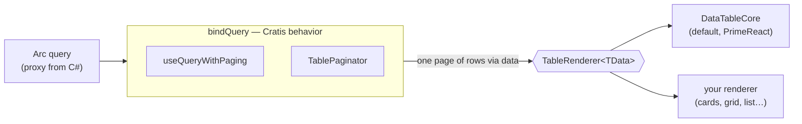

# Bring your own table renderer

Cratis's value in a data table is the *behavior* — subscribing to an Arc query, paging it, tracking selection — not the pixels. `DataTableForQuery` renders that behavior with PrimeReact, but the two are not welded together. A small, UI-library-agnostic seam sits between them, so you can keep every bit of Cratis's query and paging behavior and swap in **your own** table rendering: a different component library, a virtualized grid, or a hand-rolled list.

This page shows how to plug a renderer of your own into that seam.

## The seam

Two pieces make up the rendering seam:

- **`TableRenderer<TData>`** — the contract a renderer implements. It is a component that receives one page of rows plus selection and paging-agnostic props, and renders them however it likes. It carries no PrimeReact (or any other UI-library) types.
- **`bindQuery(renderer)`** / **`bindObservableQuery(renderer)`** — higher-order helpers that pair Cratis's query + paging behavior with any `TableRenderer`, returning a paged table component with the same props and behavior the built-in tables expose.

`DataTableForQuery` is simply `bindQuery(DataTableCore)` — the default `DataTableCore` renderer bound to the snapshot query behavior. Nothing about the built-in table is privileged; your renderer plugs into exactly the same machinery.



## What a renderer receives

A `TableRenderer<TData>` is given `TableRendererProps<TData>`. The binding fills these in for you:

| Prop | Meaning |
|---|---|
| `data` | The current page of rows, already paged by the binding. |
| `emptyMessage` | What to show when there are no rows. |
| `children` | Whatever you passed as children — e.g. `<Column>` elements, if your renderer reads them. |
| `dataKey` | The row property that uniquely identifies a row. |
| `selection` / `onSelectionChange` | The selected row and the change callback. |
| `selectionMode` | `'single'` when the binding drives single-row selection. |
| `onRowClick` | Row-click callback. |
| `globalFilterFields` / `defaultFilters` | Filtering hints. |
| `scrollable` / `scrollHeight` | Scroll-region hints (set by `bindObservableQuery`). |
| `className` / `style` | Root class and style. |

Your renderer reads what it needs and ignores the rest. Notably, it never sees the query — that stays on the behavior side of the seam.

## Write a renderer

A renderer is a plain component, generic over the row type just like `DataTableCore`. Here is a trivial one that renders a card per row instead of a table:

```tsx
import type { TableRenderer, TableRendererProps } from '@cratis/components/DataTables';

const CardListRenderer = <TData extends object,>({ data, emptyMessage }: TableRendererProps<TData>) => {
    if (data.length === 0) {
        return <div className="empty">{emptyMessage}</div>;
    }
    return (
        <div className="card-list">
            {data.map((row, index) => (
                <article key={index} className="card">
                    {Object.entries(row).map(([field, value]) => (
                        <span key={field}><strong>{field}: </strong>{String(value)}</span>
                    ))}
                </article>
            ))}
        </div>
    );
};
```

The `<TData extends object,>` type parameter is what lets one renderer serve any row type — the same shape `DataTableCore` uses. That is all the seam requires.

## Bind it to a query

Pair the renderer with Cratis's query + paging behavior by calling `bindQuery`. The result is a component with the same props as `DataTableForQuery`:

```tsx
import { bindQuery } from '@cratis/components/DataTables';
import { AllProducts } from './AllProducts';   // proxy from C#

const CardListForQuery = bindQuery(CardListRenderer);

<CardListForQuery query={AllProducts} emptyMessage="No products" dataKey="id" />;
```

You wrote no query, paging, or subscription code. `CardListForQuery` subscribes to `AllProducts`, feeds one page of rows to your renderer through `data`, and shows a paginator when the result spans more than one page — exactly what `DataTableForQuery` does, only your rendering shows up instead of a table.

## Real-time queries

For a real-time [observable query](./data-table-for-observable-query.md), bind the same renderer with `bindObservableQuery` instead. It subscribes via `useObservableQueryWithPaging`, re-renders as the read model changes server-side, and asks your renderer to scroll (`scrollable` / `scrollHeight`) inside a region that resizes to fill its container:

```tsx
import { bindObservableQuery } from '@cratis/components/DataTables';
import { AllTasks } from './AllTasks';   // observable proxy from C#

const CardListForObservableQuery = bindObservableQuery(CardListRenderer);

<CardListForObservableQuery query={AllTasks} emptyMessage="No tasks" dataKey="id" />;
```

## When this is the wrong fit

Reach for the seam only when you genuinely need different rendering. If PrimeReact styling is all you want to change, stay on `DataTableForQuery` and use its `pt` / `ptOptions` / `unstyled` pass-through and [column configuration](./column-configuration.md) — you get theming and accessibility handled for you. A custom renderer owns its own markup, styling, sorting affordances, and accessibility; the seam gives you Cratis's data behavior, not a free table.

## See also

- [DataTableForQuery](./data-table-for-query.md) — the default snapshot table (`bindQuery(DataTableCore)`).
- [DataTableForObservableQuery](./data-table-for-observable-query.md) — the default real-time table.
- [Column Configuration](./column-configuration.md) — the `<Column>` authoring model the default renderer reads.
