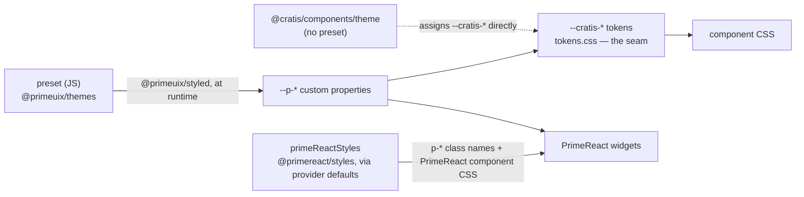

# Styling

> [!CAUTION]
> **PrimeReact 11 is not MIT.**
> `@cratis/components` is MIT, but as of 3.0.0 it builds on **PrimeReact 11**, which is part of
> PrimeTek's commercial **PrimeUI** family — as are `primeicons` 8.x, `@primereact/core`,
> `@primereact/headless`, `@primereact/styles`, `@primeuix/themes` and `@primeuix/styled`. PrimeReact 10 was MIT; 11 is not.
>
> A **PrimeUI license key is required regardless of how you style** — the check runs when
> `PrimeReactProvider` mounts, not when a theme is applied. Without one you get a console warning and
> an *"Invalid PrimeUI License"* banner, in development and production.
>
> The [Community License](https://primeui.dev/licenses/community) is free for individuals, students,
> non-profits, non-commercial open source, and organizations under $1M revenue with fewer than 5
> developers. Everyone else needs a [Commercial License](https://primeui.dev/licenses/commercial).
> Redistributing a library that others build with needs a separate OEM License.
>
> Need to stay MIT-only? **`@cratis/components` 2.x remains on PrimeReact 10.** See
> [Licensing](/components/migration/#licensing).

Cratis Components is built on top of PrimeReact 11 and stays out of your way when it comes to styling. PrimeReact 11 is **unstyled-first** — it ships no widget chrome by default — so you decide the look: use the Cratis baseline theme, run PrimeReact's own styled mode, keep a theme's structure while painting your own palette, or take complete control and provide every visual yourself — all without forking the library or fighting it.

The supported styling setups are not mutually exclusive: every component still exposes the same building blocks, so you can combine them per-component or per-region of your app.

## TL;DR — choose a styling setup

| Setup | When | Effort | What you write |
|---|---|---|---|
| [**Cratis baseline theme**](baseline-theme.md) | You want a polished default look with no extra dependency. | Lowest | `import '@cratis/components/theme'` + `class="cratis-theme"` |
| [**PrimeReact's styled mode**](themed.md) | You want PrimeReact's own look — a `@primeuix/themes` preset painting PrimeReact's component styles — and have a PrimeUI license key. | Low | `...styledMode()` from `@cratis/components/styled` in the provider `value` (+ a `license` key); install `@primereact/styles` and `@primeuix/themes` |
| [**A custom palette on top of a theme**](custom-palette.md) | You want a theme's structure but your own colors. | Low | `--cratis-*` overrides on the baseline theme, or `styledMode({ preset: definePreset(CratisPreset, …) })` |
| [**Fully unstyled mode**](unstyled.md) | You're integrating into a tightly controlled design system. | Highest | `unstyled: true` + a `pt` preset in CSS or Tailwind |

Every setup shares the same install and stylesheet imports described in [Getting Started](getting-started.md). You can change direction later because the same provider, tokens, and `pt` hooks stay available.

## Why the themed options need a theme

**PrimeReact 11 ships zero CSS.** There is no `primereact/resources/themes/*.css` any more — the v10 theme stylesheets do not exist, and there is nothing to `<link>` or `import`. The `primereact` package is **unstyled primitives**: on its own it supplies **no** widget chrome at all — no padding, borders, dialog frame, focus rings, or button shapes — and its elements carry **no `p-*` class names**; parts are identified by data attributes instead (`[data-scope="dialog"][data-part="close"]`). The `p-*` class names and the CSS behind them live in a separate package, `@primereact/styles`, and PrimeReact's own styled components (`@primereact/ui`) are simply the primitives with those styles preset. `@cratis/components` builds on the primitives.

That has one consequence worth stating plainly: **a `@primeuix/themes` preset by itself styles nothing here.** Handing the provider `theme: { preset }` emits the `--p-*` design tokens at runtime, but with no `p-*` class on any element the preset has nothing to paint.

So every setup except fully-unstyled starts from a theme, and that chrome comes from one of two sources:

- the **Cratis baseline theme** (`import '@cratis/components/theme'` + `class="cratis-theme"`) — a token-based default look that needs no `@primereact/styles` or `@primeuix/themes` dependency.
- **PrimeReact's styled mode** — `styledMode()` from `@cratis/components/styled`, spread into the provider `value`. It supplies a `@primeuix/themes` preset (default `CratisPreset`; Aura, Lara, Nora, or a `definePreset` result all work) **and** `primeReactStyles`, PrimeReact's own component styles, which the provider applies to every primitive rendered under it — the ones this library renders and the ones your application renders itself. That is what makes the `p-*` class names appear and the preset paint them. It needs `@primereact/styles` and `@primeuix/themes` installed (both optional peers).

Either way, a **PrimeUI license key** is required — the check runs when the provider mounts, whichever look you choose (a free community tier or a paid one); without it PrimeReact shows an "Invalid PrimeUI License" banner in development *and* production.

Without either — and without your own `pt` / CSS — components render as the raw HTML primitives the browser supplies by default.

The `--cratis-*` token layer is an additive Cratis-scoped tint for surfaces the wrappers in this package own — validation error text, the FormElement addon background, breadcrumb borders — and **is not, by itself, sufficient to skin PrimeReact widgets**. In styled mode, derive your own preset (`definePreset(CratisPreset, …)`) when you want the whole UI in your palette; under the baseline theme, override the `--cratis-*` tokens. Use `unstyled: true` and a `pt` preset when you want to replace PrimeReact's visuals entirely.

## Mental model

Every component you import from `@cratis/components` is a thin wrapper around a PrimeReact primitive plus a few Cratis additions (validation hooks, command-form integration, …). The important thing to understand about v11 is that a theme is **JavaScript, not CSS**, and comes in two halves: a preset — a plain token object that `@primeuix/styled` turns into `--p-*` custom properties **at runtime**, when you hand it to the provider — and PrimeReact's component styles, which put the `p-*` class names on the primitives and carry the CSS those tokens drive. So the chain runs:

`styledMode()` hands the provider both the preset and `primeReactStyles`. Read as three layers you can intervene at:

1. **PrimeReact design tokens** — the `--p-*` custom properties emitted at runtime from a `@primeuix/themes` preset, customized via `definePreset`. Read by PrimeReact's component CSS, which reaches the widgets through the `p-*` class names `primeReactStyles` puts on them. Derive your own preset to repaint the whole UI — in styled mode.
2. **Cratis tokens** — `--cratis-surface-card`, `--cratis-text-color`, `--cratis-primary-color`, … Read only by Cratis-scoped surfaces. In `tokens.css` each resolves the v11 design token first (e.g. `--p-content-border-color`) and falls back to the legacy v10 variable, which is what keeps a half-ported app working during its upgrade window. With the baseline theme instead of a preset, `@cratis/components/theme` assigns these tokens concrete values directly — light and dark — and defers to a preset's `--p-*` when one *is* present. Override them when you want a Cratis surface tinted differently from the surrounding PrimeReact widgets.
3. **PrimeReact `pt` (pass-through)** — A per-component prop that lets you attach CSS class names (or inline styles) to every slot inside a PrimeReact widget. The strongest customization knob; works hand-in-hand with `unstyled` mode.

The [Cratis token reference](cratis-tokens.md) lists every token and the surface it tints. The [pass-through cheat sheet](pass-through.md) lists every Cratis wrapper and which pt props it exposes.

## See also

- [Getting Started](getting-started.md) — the install, stylesheet imports, and provider every option shares
- [Use the Cratis baseline theme](baseline-theme.md) — the default look, no preset needed
- [Use PrimeReact's styled mode](themed.md) — `styledMode()`: a `@primeuix/themes` preset plus PrimeReact's component styles (needs a license)
- [Use a custom palette on top of a theme](custom-palette.md)
- [Use fully unstyled mode](unstyled.md)
- [Cratis token reference](cratis-tokens.md)
- [Pass-through (pt) cheat sheet](pass-through.md)
- [Combining styling setups](mixing-paths.md)
- [CratisComponentsProvider](../Common/cratis-components-provider.md)
