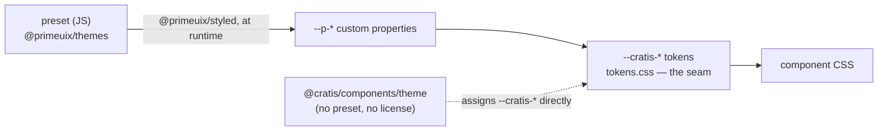

# Styling

Cratis Components is built on top of PrimeReact 11 and stays out of your way when it comes to styling. PrimeReact 11 is **unstyled-first** — it ships no widget chrome by default — so you decide the look: apply a ready-made theme, keep a theme's structure while painting your own palette, or take complete control and provide every visual yourself — all without forking the library or fighting it.

The supported styling setups are not mutually exclusive: every component still exposes the same building blocks, so you can combine them per-component or per-region of your app.

## TL;DR — choose a styling setup

| Setup | When | Effort | What you write |
|---|---|---|---|
| [**Cratis baseline theme**](baseline-theme.md) | You want a polished default look with **no license**. | Lowest | `import '@cratis/components/theme'` + `class="cratis-theme"` |
| [**A `@primeuix/themes` preset**](themed.md) | You want one of PrimeReact's design systems and have a PrimeUI license key. | Low | A preset via `value={{ theme: { preset } }}` (+ a `license` key) |
| [**A custom palette on top of a theme**](custom-palette.md) | You want a theme's structure but your own colors. | Low | A theme + `--cratis-*` (or preset) token overrides |
| [**Fully unstyled mode**](unstyled.md) | You're integrating into a tightly controlled design system. | Highest | `unstyled: true` + a `pt` preset in CSS or Tailwind |

Every setup shares the same install and stylesheet imports described in [Getting Started](getting-started.md). You can change direction later because the same provider, tokens, and `pt` hooks stay available.

## Why the themed options need a theme

**PrimeReact 11 ships zero CSS.** There is no `primereact/resources/themes/*.css` any more — the v10 theme stylesheets do not exist, and there is nothing to `<link>` or `import`. On its own PrimeReact supplies **no** widget chrome at all: no padding, borders, dialog frame, focus rings, or button shapes. It also emits no `p-*` class names when nothing is applied; parts are identified by data attributes instead (`[data-scope="dialog"][data-part="close"]`).

So every setup except fully-unstyled starts from a theme, and that chrome comes from one of two license-relevant sources:

- the **Cratis baseline theme** (`import '@cratis/components/theme'` + `class="cratis-theme"`) — a token-based default look that needs **no license**.
- a `@primeuix/themes` **preset** — Aura, Lara, Nora. Applying one requires a **PrimeUI license key** (a free community tier or a paid one); without it PrimeReact shows an "Invalid PrimeUI License" banner in development *and* production.

Without either — and without your own `pt` / CSS — components render as the raw HTML primitives the browser supplies by default.

The `--cratis-*` token layer is an additive Cratis-scoped tint for surfaces the wrappers in this package own — validation error text, the FormElement addon background, breadcrumb borders — and **is not, by itself, sufficient to skin PrimeReact widgets**. Customize the active preset (via `@primeuix/themes` `definePreset`) when you want the whole UI in your palette. Use `unstyled: true` and a `pt` preset when you want to replace PrimeReact's visuals entirely.

## Mental model

Every component you import from `@cratis/components` is a thin wrapper around a PrimeReact component plus a few Cratis additions (validation hooks, command-form integration, …). The important thing to understand about v11 is that a preset is **JavaScript, not CSS** — a plain token object that `@primeuix/styled` turns into `--p-*` custom properties **at runtime**, when you hand it to the provider. So the chain runs:

Read as three layers you can intervene at:

1. **PrimeReact design tokens** — the `--p-*` custom properties emitted at runtime from a `@primeuix/themes` preset, customized via `definePreset`. Read directly by PrimeReact widgets. Customize the preset to repaint the whole UI.
2. **Cratis tokens** — `--cratis-surface-card`, `--cratis-text-color`, `--cratis-primary-color`, … Read only by Cratis-scoped surfaces. In `tokens.css` each resolves the v11 design token first (e.g. `--p-content-border-color`) and falls back to the legacy v10 variable, which is what keeps a half-ported app working during its upgrade window. With the license-free baseline theme instead of a preset, `@cratis/components/theme` assigns these tokens concrete values directly — light and dark — and defers to a preset's `--p-*` when one *is* present. Override them when you want a Cratis surface tinted differently from the surrounding PrimeReact widgets.
3. **PrimeReact `pt` (pass-through)** — A per-component prop that lets you attach CSS class names (or inline styles) to every slot inside a PrimeReact widget. The strongest customization knob; works hand-in-hand with `unstyled` mode.

The [Cratis token reference](cratis-tokens.md) lists every token and the surface it tints. The [pass-through cheat sheet](pass-through.md) lists every Cratis wrapper and which pt props it exposes.

## See also

- [Getting Started](getting-started.md) — the install, stylesheet imports, and provider every option shares
- [Use the Cratis baseline theme](baseline-theme.md) — the license-free default look
- [Use a PrimeReact theme](themed.md) — a `@primeuix/themes` preset (needs a license)
- [Use a custom palette on top of a theme](custom-palette.md)
- [Use fully unstyled mode](unstyled.md)
- [Cratis token reference](cratis-tokens.md)
- [Pass-through (pt) cheat sheet](pass-through.md)
- [Combining styling setups](mixing-paths.md)
- [CratisComponentsProvider](../Common/cratis-components-provider.md)
