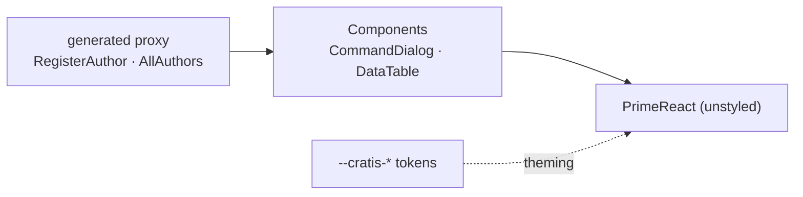

import { Steps, Aside } from '@astrojs/starlight/components';

You've built an Arc backend — a `RegisterAuthor` command, an `AllAuthors` query — and `dotnet build` has generated the typed proxies for both. Now you need a screen: a form to add an author, a table that lists them and refreshes itself when one's added.

You *could* build that straight on PrimeReact — instantiate the command, track its executing state, disable the button while it runs, render OK/Cancel, bind every field, call the query, subscribe to its observable, re-render on change. That's a few files of glue for one screen. `@cratis/components` already knows how to do all of it against your generated proxies, so the same screen is a few declarative lines. Let's wire it up.

<Aside type="note" title="What you need first">
A frontend that already reaches your Arc backend through generated proxies — the [Arc frontend get-started](/arc/frontend/getting-started/) sets that up. Components renders forms and tables *on top* of those proxies; if you scaffolded with `dotnet new cratis`, it's already installed and you're here to understand the pieces.
</Aside>

## Install and wire it up

<Steps>

1. **Install the package and its PrimeReact peers.**

   ```bash title="Install Components"
   npm install @cratis/components primereact primeicons
   ```

   A few components pull extra peers only when you use them — `pixi.js` for `PivotViewer`, `framer-motion` for animated panels, `allotment` for `DataPage`. Skip them until you reach for those.

2. **Import the styles once**, at your app's entry point:

   ```typescript title="main.tsx"
   import '@cratis/components/styles';
   ```

   This ships the pre-compiled utility styles and the `--cratis-*` [token layer](/components/styling/) the components read their colors and spacing from. It works with any bundler.

3. **Mount the provider** around your app:

   ```tsx title="App.tsx"
   import '@cratis/components/styles';
   import { CratisComponentsProvider } from '@cratis/components';

   export const App = () => (
       <CratisComponentsProvider>
           <YourApp />
       </CratisComponentsProvider>
   );
   ```

</Steps>

## What the provider sets up

That one wrapper does more than it looks. Components renders PrimeReact in **unstyled mode** with a pass-through preset, configures locale, ripple, and overlay z-index, and routes every component's look through the `--cratis-*` tokens you just imported. The upshot: everything below it renders structurally right away, and it takes its visual identity from tokens you control — not from styles baked into the library.



The components sit between your typed proxies and PrimeReact: they speak commands and queries on one side, render PrimeReact on the other, and take their styling from tokens.

## See the payoff

Here's the add-author form — the whole thing. `CommandDialog` takes your generated command, renders the fields and the confirm/cancel buttons, and disables confirm while it executes:

```tsx title="AddAuthor.tsx"
import { CommandDialog } from '@cratis/components/CommandDialog';
import { InputTextField } from '@cratis/components/CommandForm';
import { RegisterAuthor } from './Authors/RegisterAuthor';   // generated proxy

export const AddAuthor = () => (
    <CommandDialog<RegisterAuthor> command={RegisterAuthor} title="Add author" okLabel="Add">
        <InputTextField<RegisterAuthor> value={i => i.name} title="Name" />
    </CommandDialog>
);
```

No `isExecuting` flag, no button wiring, no validation written by hand — and because `RegisterAuthor` is generated from your C#, `i => i.name` is type-checked against the real command. Rename the property in C#, rebuild, and this line stops compiling until you fix it. That's the few-lines-not-few-files promise, with the type safety to back it.

## Choose how it looks

The components render structurally the moment the provider is mounted; their *look* is a separate, deliberate choice. Pick one setup on the [Styling](/components/styling/) page:

- a ready-made PrimeReact theme,
- a theme repainted with a custom `--cratis-*` palette, or
- fully unstyled, with your own pass-through preset.

## Recap

You installed `@cratis/components`, imported its styles, and wrapped your app in `CratisComponentsProvider` — and with that one provider in place, a typed command form is a handful of lines instead of a handful of files. Everything else in the library works the same way: declare it, point it at a proxy, done.

## Where to go next

- **[Building a form](/components/building-a-form/)** — `CommandDialog`, field types, validation, and multi-step wizards.
- **[Displaying data](/components/displaying-data/)** — live data tables that re-render when the read model changes.
- **[Choosing a component](/components/choosing-a-component/)** — a decision guide from "what's on the screen" to the right component.
- **[Build a full-stack feature](/build-a-full-app/)** — see Components consume a real Arc slice end to end.
