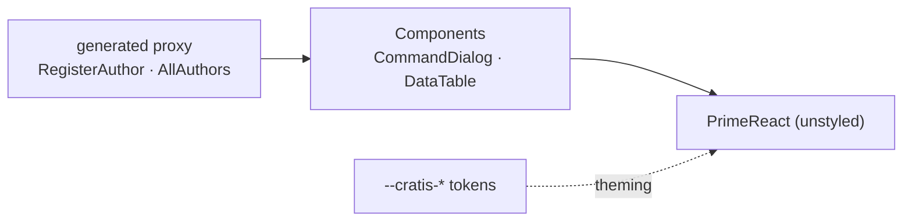

import { Steps, Aside } from '@astrojs/starlight/components';

You've built an Arc backend — a `RegisterAuthor` command, an `AllAuthors` query — and `dotnet build` has generated the typed proxies for both. Now you need a screen: a form to add an author, a table that lists them and refreshes itself when one's added.

You can build that straight on PrimeReact — instantiate the command, track its executing state, disable the button while it runs, render OK/Cancel, bind every field, call the query, subscribe to its observable, re-render on change. `@cratis/components` centralizes that integration around your generated proxies, so the same screen is a few declarative lines. Let's wire it up.

## Prerequisites

- **A React app** — a Vite + React frontend (the `dotnet new cratis` template scaffolds one).
- **An Arc frontend that reaches your backend through generated proxies** — the [Arc frontend get-started](/arc/frontend/getting-started/) sets that up. Components renders forms and tables *on top* of those proxies. If you scaffolded with `dotnet new cratis`, the package is already installed and you're here to understand the pieces.

## Install and wire it up

<Steps>

1. **Install the package — and PrimeReact alongside it.**

   ```bash title="Install Components"
   npm install @cratis/components primereact @primereact/core @primereact/headless primeicons
   ```

   From 3.0, PrimeReact is a **peer dependency**, so you supply it and the library uses yours. That's not bureaucracy: when the library bundled its own copy, an app that also depended on `primereact` could end up with **two** — and two copies means two `PrimeReactProvider` contexts, so overlays stack wrongly and `pt` silently stops applying, with no error to point at it. One declared peer is one copy. If you carried a `resolutions` / `overrides` pin for `primereact` to work around this, delete it.

   `primeicons` went 7 → 8 with PrimeReact 11. The heavier extras — `pixi.js` (`PivotViewer`), `framer-motion` (animated panels), `allotment` (`DataPage`) — are still regular dependencies and install automatically. The remaining peers (`react`/`react-dom` 19+, `@cratis/arc*`, `reflect-metadata`, `tsyringe`) already come with the Arc frontend from the prerequisites.

2. **Import the stylesheets once**, at your app's entry point, in this order:

   ```typescript title="main.tsx"
   import '@cratis/components/tokens';   // the --cratis-* token layer
   import '@cratis/components/styles';   // every component stylesheet, in one file
   import '@cratis/components/theme';    // optional — the Cratis baseline look (MIT CSS)
   ```

   :::caution[PrimeReact 11 is not MIT]
   `@cratis/components` is MIT, but as of 3.0.0 it builds on **PrimeReact 11**, which is part of
   PrimeTek's commercial **PrimeUI** family — as are `primeicons` 8.x, `@primereact/core`,
   `@primereact/headless`, `@primereact/styles`, `@primeuix/themes` and `@primeuix/styled`. PrimeReact 10 was MIT; 11 is not.

   A **PrimeUI license key is required regardless of how you style** — the check runs when
   `PrimeReactProvider` mounts, not when a theme is applied. Without one you get a console warning and
   an *"Invalid PrimeUI License"* banner, in development and production.

   The [Community License](https://primeui.dev/licenses/community) is free for individuals, students,
   non-profits, non-commercial open source, and organizations under $1M revenue with fewer than 5
   developers. Everyone else needs a [Commercial License](https://primeui.dev/licenses/commercial).
   Redistributing a library that others build with needs a separate OEM License.

   Need to stay MIT-only? **`@cratis/components` 2.x remains on PrimeReact 10.** See
   [Licensing](/components/migration/#licensing).
   :::

   Components no longer import their own CSS — that's what lets the package load in a plain Node test environment. `tokens` declares the `--cratis-*` [token layer](/components/styling/) the components read their colors and spacing from; `styles` is the component CSS plus the pre-compiled utility styles; `theme` is optional and covered below. It works with any bundler.

   <Aside type="caution" title="Order matters">
   Import `tokens` first. Both `styles` and `theme` resolve `--cratis-*` variables that `tokens` declares.
   </Aside>

3. **Mount the provider** around your app:

   ```tsx title="App.tsx"
   import '@cratis/components/tokens';
   import '@cratis/components/styles';
   import { CratisComponentsProvider } from '@cratis/components';

   export const App = () => (
       <CratisComponentsProvider>
           <YourApp />
       </CratisComponentsProvider>
   );
   ```

</Steps>

## What the provider sets up

That one wrapper does more than it looks. Components renders PrimeReact **unstyled-first** (PrimeReact 11's default) and is the single place you layer on a `pt` preset, locale, ripple, overlay z-index, or a styled theme — routing every component's look through the `--cratis-*` tokens you just imported. The upshot: everything below it renders structurally right away, and it takes its visual identity from tokens and the styling setup you control — not from styles baked into the library.


```mermaid
flowchart LR
    Proxy["generated proxy<br/>RegisterAuthor · AllAuthors"] --> C["Components<br/>CommandDialog · DataTable"]
    C --> PR["PrimeReact (unstyled)"]
    Tokens["--cratis-* tokens"] -.->|theming| PR
```

The components sit between your typed proxies and PrimeReact: they speak commands and queries on one side, render PrimeReact on the other, and take their styling from tokens.

## See the payoff

Here's the add-author form — the whole thing. `CommandDialog` takes your generated command, renders the fields and the confirm/cancel buttons, and disables confirm while it executes:

```tsx title="AddAuthor.tsx"
import { CommandDialog } from '@cratis/components/CommandDialog';
import { InputTextField } from '@cratis/components/CommandForm';
import { RegisterAuthor } from './Authors/RegisterAuthor';   // generated proxy

export const AddAuthor = () => (
    <CommandDialog<RegisterAuthor> command={RegisterAuthor} title="Add author" okLabel="Add">
        <InputTextField<RegisterAuthor> value={i => i.name} title="Name" />
    </CommandDialog>
);
```

No `isExecuting` flag, no button wiring, no duplicate validation logic — and because `RegisterAuthor` is generated from your C#, `i => i.name` is type-checked against the real command. Rename the property in C#, rebuild, and this line stops compiling until you fix it.

## Choose how it looks

The components render structurally the moment the provider is mounted; their *look* is a separate, deliberate choice. PrimeReact 11 is unstyled-first, so pick one setup on the [Styling](/components/styling/) page:

- the **Cratis baseline theme** (`import '@cratis/components/theme'` + `class="cratis-theme"`),
- PrimeReact's **styled mode** — `import { styledMode } from '@cratis/components/styled'` and `value={{ license, ...styledMode() }}`, which hands the provider a `@primeuix/themes` preset *and* PrimeReact's own component styles (a preset alone emits tokens but paints nothing; needs `@primereact/styles` and `@primeuix/themes` installed), or
- fully unstyled, with your own `pt` / CSS.

## Recap

You installed `@cratis/components` and its PrimeReact peers, imported the token and component stylesheets, and wrapped your app in `CratisComponentsProvider` — and with that one provider in place, a typed command form is a handful of lines instead of a handful of files. Everything else in the library works the same way: declare it, point it at a proxy, done.

## Where to go next

- **[Building a form](/components/building-a-form/)** — `CommandDialog`, field types, validation, and multi-step wizards.
- **[Displaying data](/components/displaying-data/)** — live data tables that re-render when the read model changes.
- **[Choosing a component](/components/choosing-a-component/)** — a decision guide from "what's on the screen" to the right component.
- **[Build a full-stack feature](/build-a-full-app/)** — see Components consume a real Arc slice end to end.
