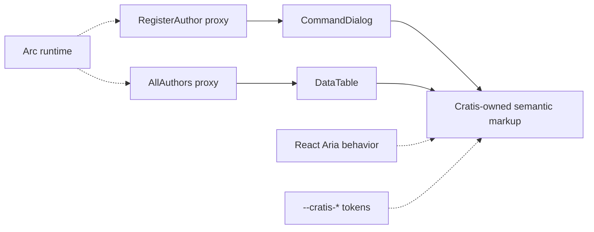

import { Steps, Aside } from '@astrojs/starlight/components';

You've built an Arc backend—a `RegisterAuthor` command and an `AllAuthors` query—and `dotnet build` generated typed proxies for both. Components turns those proxies into forms, dialogs, and data views that already know how to validate, execute, and show query results. By the end of this page you'll click **Add author**, type a name, and watch the dialog run `RegisterAuthor` and close on success.

## Prerequisites

- A React 19 application built with TypeScript. Components declares `react` and `react-dom` `^19.0.0` as peers.
- An Arc frontend with generated proxies and `experimentalDecorators`/`emitDecoratorMetadata` enabled. The [Arc tutorial's first slice](/arc/tutorial/first-slice/) sets up the project, `tsconfig.json`, and Vite proxy that this page assumes.
- `@cratis/arc` and `@cratis/arc.react` in the range `>=20.3.1 <23`. This repository builds and tests against Arc **22.16.0**; other versions in the range are accepted by the peer declaration but are not all exercised here.

The examples use the proxies from the Arc tutorial: `RegisterAuthor` has a required `id` and a `name`, and `AllAuthors` is an observable query on the `Author` read model in `./Authors/Author`.

## Install and wire it up

<Steps>

1. **Install Components.**

    ```bash title="Install Components 4"
    npm install @cratis/components@^4
    ```

    React Aria, the internationalized date implementation, and React Icons are internal dependencies. The package does not depend on PrimeReact or any other UI kit or theme runtime, and you don't configure an icon package. The optional MUI and PrimeReact integrations are separate [renderer adapter](/components/renderers/) packages.

    The package declares React, Arc, Fundamentals, `reflect-metadata`, and `tsyringe` as peers. Keep `@cratis/arc` and `@cratis/arc.react` on the same version your generated proxies were produced with. A strict installer can install every peer explicitly (replace the Arc version with the one your backend uses):

    ```bash title="Install explicit peers"
    ARC_VERSION=22.16.0
    npm install @cratis/components@^4 \
      "@cratis/arc@$ARC_VERSION" "@cratis/arc.react@$ARC_VERSION" \
      @cratis/fundamentals@^7.19.2 react@^19 react-dom@^19 \
      reflect-metadata@0.2.2 tsyringe@4.10.0
    ```

    Use Arc 22.16.0 or newer if you plan to use `AutoCommandForm`'s explicit field binding.

    `pixi.js@^8.20.0` is an additional **optional** peer, needed only if you use `Canvas` or `PivotViewer`. Every other component needs nothing beyond the peers above; install Pixi later, when you reach a spatial workspace or card-grid screen. See [Choosing a component](/components/choosing-a-component/#spatial-workspaces).

2. **Import the stylesheets once**, at your application entry point, after `reflect-metadata`:

    ```tsx title="src/main.tsx"
    import 'reflect-metadata';
    import '@cratis/components/tokens';
    import '@cratis/components/styles';
    import '@cratis/components/theme'; // optional baseline appearance
    import { createRoot } from 'react-dom/client';
    import { App } from './App';

    createRoot(document.getElementById('root')!).render(<App />);
    ```

    `tokens` defines stable `--cratis-*` variables with conservative light defaults. `styles` supplies no-Preflight component structure in low-priority Cratis layers. `theme` adds automatic and explicit dark mode, forced colors, and themed subtrees.

    A product with its own design system can omit `theme`, map its own variables onto `--cratis-*`, and customize stable `data-cratis-part` elements or `pt` attributes.

    `styles` is every component's CSS in one file. To download only the surfaces you mount, import `@cratis/components/styles/base` plus one `<subpath>/styles` entry point per surface instead — see [Per-area stylesheets](/components/styling/per-area-stylesheets/).

    <Aside type='caution' title='Order matters'>
        Import `tokens` before `styles` and `theme` so every component resolves the same
        semantic variables.
    </Aside>

    The stylesheet subpaths ship no type declarations. If TypeScript reports `TS2882: Cannot find module or type declarations for side-effect import`, declare them once, for example in `src/cratis-components-styles.d.ts`:

    ```typescript title="src/cratis-components-styles.d.ts"
    declare module '@cratis/components/tokens';
    declare module '@cratis/components/styles';
    declare module '@cratis/components/theme';
    ```

3. **Mount both providers** around your application. `<Arc>` supplies the command and query runtime the generated proxies use; `CratisComponentsProvider` supplies Components' locale, labels, and optional toast region. The Components provider does not replace `<Arc>`:

    ```tsx title="src/App.tsx"
    import { Arc } from '@cratis/arc.react';
    import { CratisComponentsProvider } from '@cratis/components';
    import { Library } from './Library';

    export const App = () => (
        <Arc>
            <CratisComponentsProvider value={{ locale: 'en-US' }} toaster>
                <Library />
            </CratisComponentsProvider>
        </Arc>
    );
    ```

</Steps>

### Yarn PnP with Arc React 22.6.2

If you retain `@cratis/arc.react@22.6.2`, that version imports `rxjs` without declaring it. A strict Yarn PnP consumer needs `rxjs@7.8.2` and this version-specific package extension:

```yaml title=".yarnrc.yml"
packageExtensions:
    '@cratis/arc.react@22.6.2':
        dependencies:
            rxjs: '7.8.2'
```

This workaround is not needed with Arc React 22.16.0. Remove the old extension when upgrading; do not apply it to every Arc version.

## What the provider sets up

`CratisComponentsProvider` supplies the locale, Components-specific labels, and an optional app-wide toast region (`toaster`). React Aria uses the locale for date, number, keyboard, and screen-reader behavior. Styling remains CSS-owned rather than provider-owned. Every value is optional, so `<CratisComponentsProvider>` with no props also works. The full configuration surface is in the [CratisComponentsProvider reference](/components/common/cratis-components-provider/).


```mermaid
flowchart LR
    Command["RegisterAuthor proxy"] --> Dialog["CommandDialog"]
    Query["AllAuthors proxy"] --> Table["DataTable"]
    Arc["Arc runtime"] -.-> Command
    Arc -.-> Query
    Dialog --> Markup["Cratis-owned semantic markup"]
    Table --> Markup
    Aria["React Aria behavior"] -.-> Markup
    Tokens["--cratis-* tokens"] -.-> Markup
```

React Aria is an implementation dependency. Public props, parts, CSS variables, and event types are owned by Cratis.

## Localize Components labels

React Aria supplies its own locale data. Configure only labels owned by Components:

```tsx
<CratisComponentsProvider
    value={{
        locale: 'nb-NO',
        messages: {
            paginator: {
                navigation: 'Sidenavigasjon',
                first: 'Første side',
                previous: 'Forrige side',
                next: 'Neste side',
                last: 'Siste side',
            },
            datePicker: {
                today: 'I dag',
                clear: 'Tøm',
                openCalendar: 'Åpne kalender',
                previousMonth: 'Forrige måned',
                nextMonth: 'Neste måned',
            },
        },
    }}
>
    <YourApp />
</CratisComponentsProvider>
```

## See the payoff

`CommandDialog` takes the generated command, renders its fields and the OK/Cancel footer, keeps **Add** disabled until the form is valid, disables every button while the command executes, and closes only when the command succeeds:

```tsx title="src/AddAuthor.tsx"
import { useState } from 'react';
import { Guid } from '@cratis/fundamentals';
import { CommandDialog } from '@cratis/components/CommandDialog';
import { InputTextField } from '@cratis/components/CommandForm';
import { RegisterAuthor } from './Authors/RegisterAuthor';

export const AddAuthor = () => {
    const [id] = useState(() => Guid.create());
    return (
        <CommandDialog<RegisterAuthor>
            command={RegisterAuthor}
            title='Add author'
            okLabel='Add'
            initialValues={{ id }}
        >
            <InputTextField<RegisterAuthor> value={(command) => command.name} title='Name' />
        </CommandDialog>
    );
};
```

The `id` is required but not typed by the user, so it goes in `initialValues`: the command is complete except for `name` from the moment the dialog opens. Setting a required value in `onBeforeExecute` instead is a common mistake — that callback runs only after the form has validated, so **Add** would never enable.

Open the dialog with Arc's `useDialog` hook. It mounts the dialog only while it is open, so every **Add author** click gets a fresh `id`:

```tsx title="src/Library.tsx"
import { useDialog } from '@cratis/arc.react/dialogs';
import { AddAuthor } from './AddAuthor';

export const Library = () => {
    const [AddAuthorDialog, showAddAuthor] = useDialog(AddAuthor);
    return (
        <>
            <button type='button' onClick={() => void showAddAuthor()}>
                Add author
            </button>
            <AddAuthorDialog />
        </>
    );
};
```

Run the app, click **Add author**, and type a name. **Add** enables, the dialog executes `RegisterAuthor` when you confirm, and it closes once the backend reports success. If the backend rejects the command, the dialog stays open and shows the validation messages against the fields. **Cancel**, the close button, and Escape close it without executing.

No `isExecuting` state, button wiring, or duplicate validation logic is required. If the C# command changes, the regenerated proxy makes this component fail compilation until you update it.

## Choose how it looks

Choose one styling posture:

- Import `theme` for the Cratis baseline.
- Define your own `--cratis-*` token values for a product design system.
- Add classes or ordinary HTML attributes through each component's Cratis-owned `pt` parts.
- Target stable `data-cratis-part` and state attributes when product CSS needs structural control.

Do not target React Aria class names or internal DOM structure. See [Styling](/components/styling/) and [Stable component parts](/components/styling/pass-through/).

## If something doesn't work

- **Add never enables** — a required command value is missing from `initialValues`. See [Troubleshooting](/components/troubleshooting/#the-command-submit-button-stays-disabled).
- **Components render unstyled** — the `tokens` and `styles` imports are missing or run after your product CSS in the wrong order. See [Troubleshooting](/components/troubleshooting/#components-render-without-styles).
- **Commands or queries never reach the backend** — check that `<Arc>` wraps the app and that its settings and your dev-server proxy match the backend routes. See [Troubleshooting](/components/troubleshooting/#commands-or-queries-do-not-reach-the-backend).

## Recap

You installed one UI package, imported Components-owned styles, mounted `<Arc>` and `CratisComponentsProvider`, and opened a command dialog generated from `RegisterAuthor`. Components owns the public React contract, Arc supplies command and query behavior, and React Aria supplies selected low-level interaction primitives internally.

Next, [build a live library screen](/components/tutorial/) — the tutorial guides you step by step through a list-and-detail page with query-backed tables and command dialogs.

## Where to go next

- [Build the library screen tutorial](/components/tutorial/) — follow one screen from a live table through command actions and list-and-detail composition
- [Building a form](/components/building-a-form/)
- [Displaying data](/components/displaying-data/)
- [Choosing a component](/components/choosing-a-component/)
- [Troubleshooting](/components/troubleshooting/) — installation, styling, rendering, and form symptoms
- [Migrate from Components 3](/components/migration/)
- [Understand the UI foundation](/components/ui-foundation/) — including the capability profiles and capability matrix behind Foundation, Advanced React, and Spatial components
