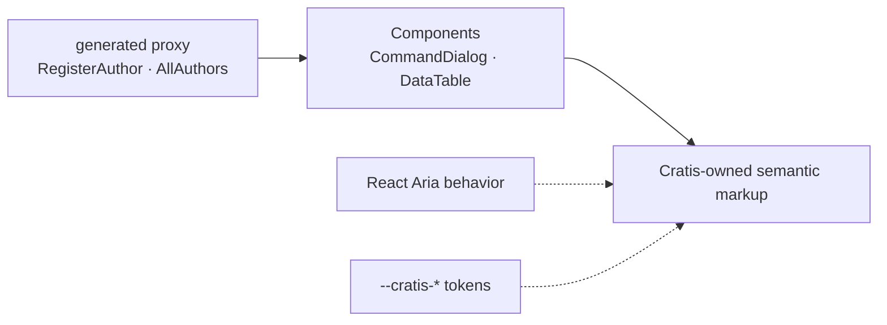

import { Steps, Aside } from '@astrojs/starlight/components';

You've built an Arc backend—a `RegisterAuthor` command and an `AllAuthors` query—and `dotnet build` generated typed proxies for both. Components turns those proxies into accessible forms, dialogs, and data views without duplicating command state, validation, or query lifecycle code.

## Prerequisites

- A React 19 application.
- An Arc frontend connected through generated proxies. The [Arc frontend guide](/arc/frontend/getting-started/) sets this up.

## Install and wire it up

<Steps>

1. **Install Components.**

    ```bash title="Install Components"
    npm install @cratis/components
    ```

    React Aria and the internationalized date implementation are internal dependencies. You do not install a UI kit, theme runtime, icon package, or commercial license for Components.

    The remaining peers—React, Arc, Fundamentals, `reflect-metadata`, and `tsyringe`—already come with an Arc frontend. Arc 20, 21, and 22 are supported.

2. **Import the Cratis-owned stylesheets once**, at your application entry point:

    ```typescript title="main.tsx"
    import '@cratis/components/tokens';
    import '@cratis/components/styles';
    import '@cratis/components/theme'; // optional baseline appearance
    ```

    `tokens` declares the stable `--cratis-*` variables. `styles` supplies component structure. `theme` provides the optional baseline light/dark values.

    A product with its own design system can omit `theme`, map its own variables onto `--cratis-*`, and customize stable `data-cratis-part` elements or `pt` attributes.

    <Aside type='caution' title='Order matters'>
        Import `tokens` before `styles` and `theme` so every component resolves the same
        semantic variables.
    </Aside>

3. **Mount the provider** around your application:

    ```tsx title="App.tsx"
    import { CratisComponentsProvider } from '@cratis/components';

    export const App = () => (
        <CratisComponentsProvider value={{ locale: 'en-US' }} toaster>
            <YourApp />
        </CratisComponentsProvider>
    );
    ```

</Steps>

## What the provider sets up

The provider supplies the locale, Components-specific labels, and an optional app-wide toast region. React Aria uses the locale for date, number, keyboard, and screen-reader behavior. Styling remains CSS-owned rather than provider-owned.


```mermaid
flowchart LR
    Proxy["generated proxy<br/>RegisterAuthor · AllAuthors"] --> C["Components<br/>CommandDialog · DataTable"]
    C --> Markup["Cratis-owned semantic markup"]
    Aria["React Aria behavior"] -.-> Markup
    Tokens["--cratis-* tokens"] -.-> Markup
```

React Aria is an implementation dependency. Public props, parts, CSS variables, and event types are owned by Cratis.

## Localize Components labels

React Aria supplies its own locale data. Configure only labels owned by Components:

```tsx
<CratisComponentsProvider
    value={{
        locale: 'nb-NO',
        messages: {
            paginator: {
                navigation: 'Sidenavigasjon',
                first: 'Første side',
                previous: 'Forrige side',
                next: 'Neste side',
                last: 'Siste side',
            },
            datePicker: {
                today: 'I dag',
                clear: 'Tøm',
                openCalendar: 'Åpne kalender',
                previousMonth: 'Forrige måned',
                nextMonth: 'Neste måned',
            },
        },
    }}
>
    <YourApp />
</CratisComponentsProvider>
```

## See the payoff

`CommandDialog` takes the generated command, renders its fields and actions, and disables confirmation while execution is in progress:

```tsx title="AddAuthor.tsx"
import { CommandDialog } from '@cratis/components/CommandDialog';
import { InputTextField } from '@cratis/components/CommandForm';
import { RegisterAuthor } from './Authors/RegisterAuthor';

export const AddAuthor = () => (
    <CommandDialog<RegisterAuthor>
        command={RegisterAuthor}
        title='Add author'
        okLabel='Add'
    >
        <InputTextField<RegisterAuthor> value={(command) => command.name} title='Name' />
    </CommandDialog>
);
```

No `isExecuting` state, action wiring, or duplicate validation logic is required. If the C# command changes, the generated proxy makes this component fail compilation until it is updated.

## Choose how it looks

Choose one styling posture:

- Import `theme` for the Cratis baseline.
- Define your own `--cratis-*` token values for a product design system.
- Add classes or ordinary HTML attributes through each component's Cratis-owned `pt` parts.
- Target stable `data-cratis-part` and state attributes when product CSS needs structural control.

Do not target React Aria class names or internal DOM structure. See [Styling](/components/styling/) and [Stable component parts](/components/styling/pass-through/).

## Recap

You installed one UI package, imported Cratis-owned styles, and mounted a locale/toast provider. Components owns the public UI contract while Arc supplies command and query behavior and React Aria supplies low-level accessible interactions.

## Where to go next

- [Building a form](/components/building-a-form/)
- [Displaying data](/components/displaying-data/)
- [Choosing a component](/components/choosing-a-component/)
- [Migrate from Components 3](/components/migration/)
- [Understand the UI foundation](/components/ui-foundation/)
