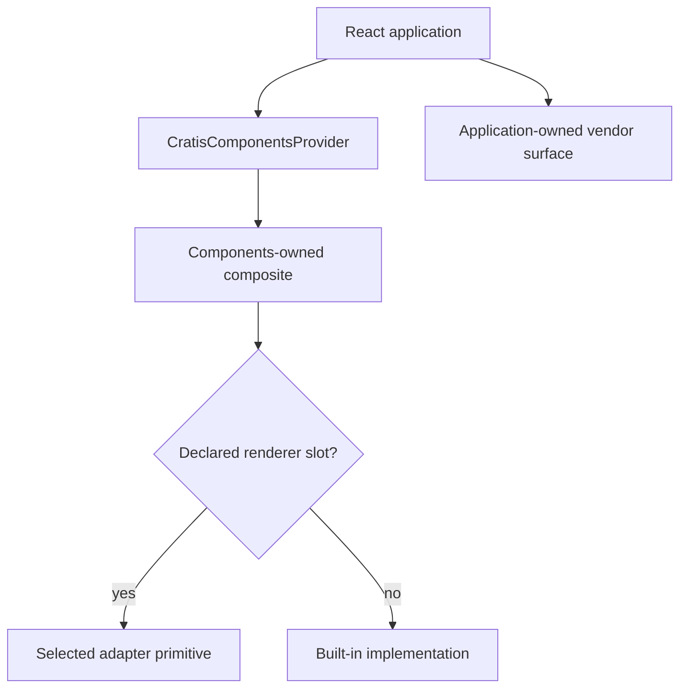

<!-- Copyright (c) Cratis. All rights reserved. -->
<!-- Licensed under the MIT license. See LICENSE file in the project root for full license information. -->

A product rarely replaces its entire interface at once. It may use Components for Arc-aware forms
and data surfaces, retain a vendor grid for one specialized screen, and adopt a different visual
language for ordinary controls. Components supports that coexistence without claiming that every
surface becomes interchangeable.

## The ownership boundary

The default path is built in. Install `@cratis/components`, mount `CratisComponentsProvider`, and
omit `library`. Components then renders its Components-owned React and HTML contracts. Semantic
native HTML handles simple controls, while the installed React Aria foundation supplies selected
focus, collection, date, and overlay behavior internally.

An optional adapter changes only the renderer slots that it declares:

| Package                           | Current upstream boundary          | Declared coverage              |
| --------------------------------- | ---------------------------------- | ------------------------------ |
| `@cratis/components.mui`          | MUI 9 and Emotion 11               | Nine stable presentation slots |
| `@cratis/components.primereact`   | PrimeReact 11 and PrimeUX themes 3 | Nine stable presentation slots |
| `@cratis/components.primereact10` | PrimeReact `>=10.9.9 <11`          | Nine stable presentation slots |

All three adapters implement renderer ABI major 1. They do not replace DataPage, DataTables,
CommandDialog, CommandForm, Toolbar, Canvas, or another Components-owned composition. The
[primitive adaptation reference](primitive-adaptation.md) lists the exact nine-slot profile.

The application-owned vendor surface is a sibling, not a hidden replacement for the Components
composite.

## Direct vendor coexistence

Keep direct vendor usage explicit. The application owns that vendor's package, provider, theme,
server-rendering setup, portal configuration, and license. Mount the vendor provider at the smallest
host boundary that needs it, and keep `CratisComponentsProvider` responsible only for Components
configuration and any selected adapter.

A direct vendor island does not need to register itself as a renderer. Register an adapter only when
it implements the public renderer ABI and accepts the exact slot props. Use [custom composition](custom-composition.md)
when an entire workflow needs vendor-native capabilities that a Components composite does not
claim.

## Providers and setup values

A renderer library may mount its own provider around the selected Components scope. Application
resources that the renderer ABI cannot safely transport stay outside that scope. In particular,
`rendererSetup` accepts only adapter-declared boolean attestations. Never place a credential,
license key, cache, provider instance, or mutable configuration object in it.

PrimeReact 11 demonstrates the boundary: the application passes its key directly to its own outer
PrimeReact provider, then gives Components only a non-secret boolean assertion that setup occurred.
The adapter fails closed when the provider or assertion is absent. The [licensing policy](licensing.md)
explains this boundary without making a licensing conclusion for an application.

## Portals and z-index

The built-in overlay environment resolves `document.body` only when an overlay needs a container.
A host may supply `overlayEnvironment` to return another container. Returning `null` defers the
overlay; it does not silently retarget it.

Direct vendor overlays keep their vendor configuration. Components does not merge a vendor portal
registry or z-index service with its built-in overlay environment. When both systems can open
simultaneously, the application must:

- choose containers that are not clipped by local overflow;
- assign an explicit layer order for Components and vendor overlays;
- verify nested menus, listboxes, dialogs, and toasts in the real application shell; and
- keep theme CSS and portal CSS available in every chosen container.

The nine-slot adapters do not include dialog, dropdown, date-picker, tooltip, or paginator atomic
slots. Those controls therefore use the built-in implementation unless another adapter explicitly
and honestly declares them.

## Focus ownership

One interactive surface owns one focus lifecycle. Do not place one modal implementation inside
another modal merely to borrow vendor appearance, and do not combine two focus traps, dismissal
listeners, or keyboard-selection owners for the same interaction. A presentation adapter must
preserve the Components contract without adding a second semantic control. An atomic adapter, if
one is selected, owns the complete interaction instead of wrapping the built-in owner.

This rule is structural, not a universal accessibility certification. Verify keyboard order, initial
focus, focus restoration, escape handling, background inertness, and screen-reader output in the
application's supported browsers and assistive technologies.

## Continue

- Use [primitive adaptation](primitive-adaptation.md) when the nine stable controls need vendor
  presentation.
- Use [custom composition](custom-composition.md) when the workflow itself must be vendor-native.
- Check [unsupported renderer claims](unsupported.md) before promising replacement behavior.
