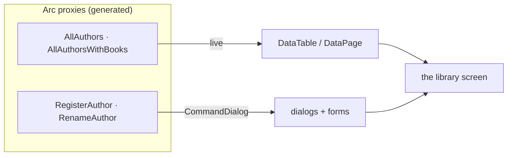

In the [Arc tutorial](/arc/tutorial/) you built a library backend: a `RegisterAuthor` command, an `AllAuthors` query, books that belong to authors. Now we'll build the screen a librarian actually uses — and we'll do it the Cratis way, where the UI rides directly on the generated proxies and updates itself.

Here's the thing to hold onto as we go: **you won't write the wiring between the screen and the backend.** No `fetch`, no loading flags, no "refresh the list after saving," no hand-bound form fields. Components already knows how to render a command as a form and a query as a live table — so each screen is a few declarative lines, type-checked against the C# it came from. We'll build it up in three short chapters, stopping at each step to see what just happened.

## What you'll build

A working library admin screen where a librarian can:

- **see every author in a live table** that updates the instant one is added — no refresh,
- **add, rename, and remove** authors through typed command dialogs,
- and **select an author to see their books** in a resizable detail panel beside the list.

## What you'll learn

- How a **live data table** binds to an observable query and re-renders itself.
- How `CommandDialog` and `useDialog` turn a command into a form-with-a-button, validation included.
- How `DataPage` gives you a **list-and-detail** layout — selection, columns, menu actions, and a detail panel — out of the box.
- Why you point each screen at a **purpose-built read model** rather than one shared model.

## What you'll need

- An Arc backend with the library slices from the [Arc tutorial](/arc/tutorial/) — at minimum `AllAuthors` and `RegisterAuthor`, and (for the last chapter) `AllAuthorsWithBooks`.
- Components installed and the provider mounted — the [Get started](/components/getting-started/) page does this in three steps. Come back when `CratisComponentsProvider` wraps your app.

## The tour

1. **[List the authors](./list-it)** — a live table from the `AllAuthors` query.
2. **[Act on the list](./act-on-it)** — add, rename, and remove with command dialogs, driven by selection.
3. **[List and detail](./list-and-detail)** — swap the plain table for a `DataPage` and show each author's books.

By the end you'll have a real screen, and the pattern for every other one in your app. Ready? [Let's put the authors on screen →](./list-it)
