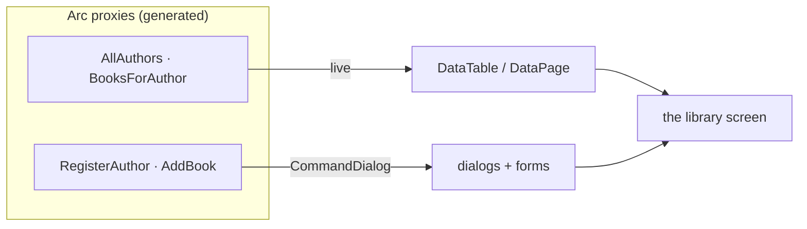

In the [Arc tutorial](/arc/tutorial/) you built a library backend: a `RegisterAuthor` command, an `AllAuthors` query, and books that belong to authors. Now we'll build the screen a librarian actually uses — and we'll do it the Cratis way, where the UI rides directly on the generated proxies and updates itself.

Here's the thing to hold onto as we go: **you won't write the wiring between the screen and the backend.** No `fetch`, no loading flags, no "refresh the list after saving," no hand-bound form fields. Components already knows how to render a command as a form and a query as a live table — so each screen is a few declarative lines, type-checked against the C# it came from. We'll build it up in three short chapters, stopping at each step to see what just happened.

Each generated proxy maps to one Components widget. A query becomes a live table, a command becomes a dialog:

```mermaid
flowchart LR
    subgraph Backend["Arc proxies (generated)"]
        Q["AllAuthors · BooksForAuthor"]
        C["RegisterAuthor · AddBook"]
    end
    Q -->|live| T["DataTable / DataPage"]
    C -->|CommandDialog| D["dialogs + forms"]
    T --> S["the library screen"]
    D --> S
```

The commands write to the database, the observable queries push the new results, and the screen follows. You never connect the two sides yourself.

## What you'll build

A working library admin screen where a librarian can:

- **see every author in a live table** that updates the instant one is added — no refresh,
- **add authors** through a typed command dialog,
- and **select an author to see their books** in a resizable detail panel beside the list, then **add a book** to the selected author.

## What you'll learn

- How a **live data table** binds to an observable query and re-renders itself.
- How `CommandDialog` and `useDialog` turn a command into a form-with-a-button, validation included, and why required values go in `initialValues`.
- How `DataPage` gives you a **list-and-detail** layout — selection, columns, menu actions, and a detail panel — out of the box.
- Why you point each screen at a **purpose-built query** rather than one shared model.

## What you'll need

- The library backend from the Arc tutorial through [chapter 3, Relate your slices](/arc/tutorial/books-and-relationships/): `RegisterAuthor` and the observable `AllAuthors` query from chapter 1, and `AddBook` and the observable `BooksForAuthor` query from chapter 3. The generated proxies live in `src/Authors/` and `src/Books/`.
- Components installed, the styles imported, and `<Arc>` plus `CratisComponentsProvider` mounted. The [Getting started](/components/getting-started/) page does this in three steps. If you followed the Arc tutorial, its first chapter already did it.

:::note[Components works with any Arc backend]
The Arc tutorial writes directly to MongoDB or EF Core, so the tables in this tutorial update because the observable queries report database changes. With a Chronicle backend the same screens update when a projection changes the read model. The frontend code does not change.
:::

## The tour

1. **[List the authors](./list-it.mdx)** — a live table from the `AllAuthors` query.
2. **[Act on the list](./act-on-it.mdx)** — add authors with a command dialog and watch the table follow.
3. **[List and detail](./list-and-detail.mdx)** — swap the plain table for a `DataPage`, show each author's books, and add a book to the selected author.

By the end you'll have a real screen, and the pattern for every other one in your app. Ready? [Let's put the authors on screen →](./list-it.mdx)
